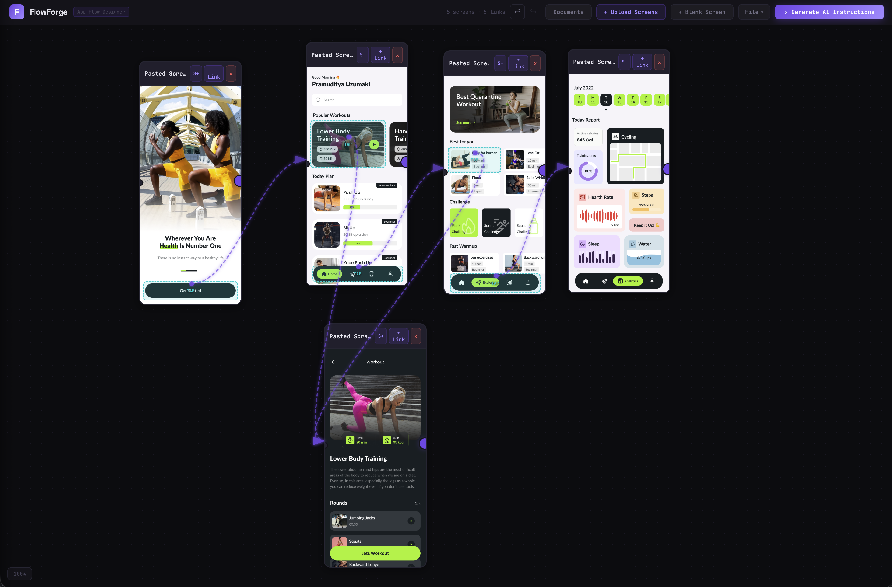

# Drawd

**Draw the logic. Let AI build it right.**

Stop writing paragraphs to describe your app. Draw the flow instead.

When you describe a login flow in prose, AI builds 3 screens instead of 7. The error state is missing. The loading screen is forgotten. The conditional branch is ignored. You spend more time fixing the output than you saved generating it.

Drawd is a visual app flow designer that turns your screen designs into structured, AI-ready build instructions -- complete, unambiguous, and impossible to misinterpret.

**[Try it now →](https://drawd.vercel.app/)**



---

## The Problem

AI is great at writing code. It is terrible at reading your mind.

You paste a paragraph into ChatGPT describing your app's navigation. It hallucinates screens you didn't mention, skips the ones you did, and connects them in ways that make no sense. You correct it. It misses something else. You try again.

The problem isn't AI. The problem is **prose is a lossy format for describing interactive flows**. Navigation has structure -- screens, transitions, conditions, error states. Text flattens all of that into ambiguity.

## How It Works

1. **Upload your screens** -- drag images onto the canvas, or start with blank screens
2. **Draw hotspots** -- click and drag on screen images to define tap areas, buttons, inputs, and interactive elements
3. **Connect the flow** -- link screens with navigation arrows, define API calls, conditional branches, and error handling
4. **Generate instructions** -- one click produces structured, multi-file build instructions that AI can follow precisely

What comes out is not a paragraph. It is a complete specification: every screen cataloged, every interaction mapped, every edge case documented.

## What You Get

### Visual Flow Design
Infinite canvas. Drag-and-drop screens. Bezier connection lines. Zoom in, zoom out. Rearrange until the flow makes sense visually before a single line of code is written.

### Rich Interactions
Hotspots aren't just "tap here, go there." Define element types, API calls with success/error paths, conditional branches, modals, back navigation, and custom behaviors. The hotspot system captures what actually happens when a user taps, not just where they end up.

### AI-Ready Output
Generated instructions are split into structured files -- screen inventory, navigation map, and a platform-specific build guide for **SwiftUI**, **React Native**, **Flutter**, or **Jetpack Compose**. No ambiguity. No missing screens. No guesswork.

### Project Context
Attach API specs, design guidelines, or reference documents directly to your project. Link them to specific hotspots so AI knows exactly what endpoint to call and what response to expect.

### Works Locally
No account. No cloud. Auto-saves to a local `.drawd` file. Export, import, merge flows from multiple files. Your designs stay on your machine.

---

## Who Is This For?

- **Developers using AI to build mobile apps** -- give your AI assistant a spec it can actually follow
- **Product managers** -- communicate app logic visually instead of writing 20-page PRDs that nobody reads
- **Designers** -- hand off interactive flows, not static mockups

---

## Development

```bash
npm install
npm run dev
```

Opens at [http://localhost:5173](http://localhost:5173).

```bash
npm run build    # production build
npm test         # run tests
```

### Tech Stack

React 19, Vite, Vitest. No TypeScript, no routing, no external state management. Single-view app, plain JSX.

## License

MIT
